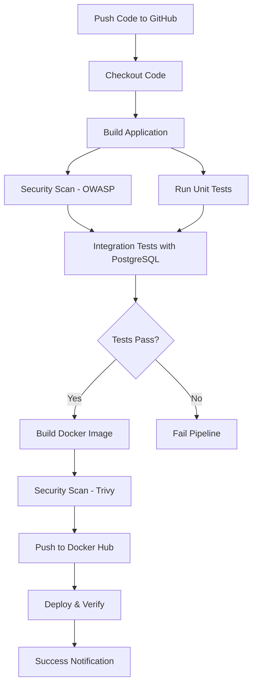

# 🚀 Spring Boot + PostgreSQL DevOps Pipeline

[](https://github.com/Mwaqarulmulk/spring-boot-postgres/actions)
[](https://hub.docker.com/r/waqarulmulk/springboot-postgres-app)
[](https://www.oracle.com/java/)
[](https://spring.io/projects/spring-boot)
[](https://www.postgresql.org/)

A production-ready Spring Boot and PostgreSQL application demonstrating complete DevOps CI/CD pipeline automation with Docker, Docker Compose, and GitHub Actions.

---

## 📋 Table of Contents

- [Overview](#overview)
- [Tech Stack](#tech-stack)
- [Features](#features)
- [Prerequisites](#prerequisites)
- [Quick Start](#quick-start)
- [Local Development](#local-development)
- [Docker Deployment](#docker-deployment)
- [CI/CD Pipeline](#cicd-pipeline)
- [API Endpoints](#api-endpoints)
- [Testing](#testing)
- [Project Structure](#project-structure)
- [Contributors](#contributors)
- [License](#license)

---

## 🎯 Overview

This project demonstrates a complete DevOps workflow for a Spring Boot application with PostgreSQL database. It includes:

- **Containerization** with Docker multi-stage builds
- **Orchestration** with Docker Compose
- **Automated CI/CD** pipeline with GitHub Actions
- **Security scanning** with OWASP and Trivy
- **Automated testing** with PostgreSQL test containers
- **Container registry** deployment to Docker Hub
- **Production-ready** configurations and best practices

---

## 🛠️ Tech Stack

### Backend
- **Java 17** - Programming language
- **Spring Boot 3.1.0** - Application framework
- **Spring Data JPA** - Data persistence
- **Maven** - Dependency management and build tool

### Database
- **PostgreSQL 15** - Relational database
- **Alpine Linux** - Lightweight container base

### DevOps & Infrastructure
- **Docker** - Containerization
- **Docker Compose** - Multi-container orchestration
- **GitHub Actions** - CI/CD automation
- **OWASP Dependency Check** - Security vulnerability scanning
- **Trivy** - Container security scanning
- **Docker Scout** - Image vulnerability analysis

### Development Tools
- **Spring Boot Actuator** - Application monitoring
- **JaCoCo** - Code coverage reporting

---

## ✨ Features

### Application Features
- ✅ RESTful API for CRUD operations
- ✅ JPA/Hibernate ORM integration
- ✅ PostgreSQL database connectivity
- ✅ Health check endpoints
- ✅ Environment-based configuration
- ✅ Comprehensive error handling

### DevOps Features
- ✅ Multi-stage Docker builds for optimized images
- ✅ Non-root container user for security
- ✅ Health checks for containers
- ✅ Named volumes for data persistence
- ✅ Network isolation
- ✅ Automated build and test pipeline
- ✅ Security vulnerability scanning
- ✅ Automated Docker Hub deployment
- ✅ Build caching for faster deployments

---

## 📦 Prerequisites

Before you begin, ensure you have the following installed:

- **Java 17** or higher
- **Maven 3.8+**
- **Docker 20.10+**
- **Docker Compose 2.0+**
- **Git**

### Optional (for development)
- IntelliJ IDEA or Eclipse
- Postman or curl for API testing

---

## 🚀 Quick Start

### 1. Clone the Repository

```bash
git clone https://github.com/Mwaqarulmulk/spring-boot-postgres.git
cd spring-boot-postgres
```

### 2. Run with Docker Compose (Recommended)

```bash
# Start all services
docker-compose up -d

# View logs
docker-compose logs -f

# Stop services
docker-compose down

# Stop and remove volumes
docker-compose down -v
```

The application will be available at: **http://localhost:8080**

### 3. Pull from Docker Hub

```bash
# Pull the latest image
docker pull waqarulmulk/springboot-postgres-app:latest

# Run the container
docker run -d -p 8080:8080 \
  -e SPRING_DATASOURCE_URL=jdbc:postgresql://host.docker.internal:5432/testdb \
  -e SPRING_DATASOURCE_USERNAME=postgres \
  -e SPRING_DATASOURCE_PASSWORD=postgres \
  --name springboot-app \
  waqarulmulk/springboot-postgres-app:latest
```

---

## 💻 Local Development

### Option 1: Run with Maven

```bash
# Navigate to the application directory
cd bezkoder-app

# Install dependencies
mvn clean install

# Run the application
mvn spring-boot:run
```

### Option 2: Run with IDE

1. Open the project in IntelliJ IDEA or Eclipse
2. Ensure Java 17 SDK is configured
3. Run `SpringBootJpaPostgresqlApplication.java` as Java Application

### Database Setup for Local Development

Start PostgreSQL using Docker:

```bash
docker run -d \
  --name postgres-local \
  -e POSTGRES_DB=testdb \
  -e POSTGRES_USER=postgres \
  -e POSTGRES_PASSWORD=postgres \
  -p 5432:5432 \
  postgres:15-alpine
```

---

## 🐳 Docker Deployment

### Build Docker Image Locally

```bash
cd bezkoder-app
docker build -t springboot-postgres-app:local .
```

### Run Application Stack

```bash
# From project root
docker-compose up -d
```

### Docker Compose Services

| Service | Container Name | Port | Description |
|---------|---------------|------|-------------|
| `db` | postgres-db | 5432 | PostgreSQL Database |
| `app` | springboot-app | 8080 | Spring Boot Application |

### Environment Variables

Configure the following environment variables in `.env` file:

```bash
# Database Configuration
POSTGRES_DB=testdb
POSTGRES_USER=postgres
POSTGRES_PASSWORD=postgres

# Application Ports
SPRING_LOCAL_PORT=8080
POSTGRESDB_LOCAL_PORT=5432
```

---

## 🔄 CI/CD Pipeline

### Pipeline Overview

The GitHub Actions pipeline automatically runs on every push to `main` and `develop` branches:



### Pipeline Stages

1. **Build & Install**
   - Set up JDK 17
   - Cache Maven dependencies
   - Run `mvn clean install -DskipTests`
   - Upload build artifacts

2. **Security Scan & Lint**
   - Run OWASP Dependency Check
   - Perform Maven verify
   - Upload security reports

3. **Run Tests**
   - Start PostgreSQL service container
   - Run unit and integration tests
   - Generate test coverage reports
   - Upload test results

4. **Build & Push Docker Image**
   - Set up Docker Buildx
   - Login to Docker Hub
   - Build multi-stage Docker image
   - Push to Docker Hub with tags (latest, SHA)
   - Run Trivy security scan
   - Run Docker Scout CVE scan

5. **Deploy & Verify**
   - Pull image from Docker Hub
   - Verify image availability
   - Display deployment information
   - Create deployment summary

6. **Notification**
   - Send failure notifications if any stage fails

### GitHub Secrets Required

Configure these secrets in GitHub repository settings:

- `DOCKER_USERNAME` - Docker Hub username
- `DOCKER_PASSWORD` - Docker Hub password/token

**Path:** Repository → Settings → Secrets and variables → Actions → New repository secret

### Manual Workflow Trigger

You can manually trigger the pipeline from GitHub Actions tab:

1. Go to **Actions** tab in GitHub
2. Select **Spring Boot CI/CD Pipeline**
3. Click **Run workflow**

---

## 🌐 API Endpoints

### Base URL
```
http://localhost:8080
```

### Tutorial API Endpoints

| Method | Endpoint | Description |
|--------|----------|-------------|
| GET | `/api/tutorials` | Get all tutorials |
| GET | `/api/tutorials/:id` | Get tutorial by ID |
| POST | `/api/tutorials` | Create new tutorial |
| PUT | `/api/tutorials/:id` | Update tutorial |
| DELETE | `/api/tutorials/:id` | Delete tutorial |
| DELETE | `/api/tutorials` | Delete all tutorials |
| GET | `/api/tutorials/published` | Get published tutorials |

### Health Check

| Method | Endpoint | Description |
|--------|----------|-------------|
| GET | `/actuator/health` | Application health status |

### Sample API Request

```bash
# Create a tutorial
curl -X POST http://localhost:8080/api/tutorials \
  -H "Content-Type: application/json" \
  -d '{
    "title": "Spring Boot Tutorial",
    "description": "Learn Spring Boot with PostgreSQL",
    "published": true
  }'

# Get all tutorials
curl http://localhost:8080/api/tutorials

# Health check
curl http://localhost:8080/actuator/health
```

---

## 🧪 Testing

### Run All Tests

```bash
cd bezkoder-app
mvn test
```

### Run with Coverage

```bash
mvn clean test jacoco:report
```

Coverage report will be available at: `target/site/jacoco/index.html`

### Integration Tests

```bash
# Start PostgreSQL container first
docker-compose up -d db

# Run integration tests
mvn verify
```

### Automated Testing Scripts

```bash
# Full test suite
chmod +x scripts/local-test.sh
./scripts/local-test.sh --full

# Quick test (build + unit tests)
./scripts/local-test.sh --quick

# Docker compose test
./scripts/local-test.sh --docker

# Security scan
./scripts/local-test.sh --security
```

---

## 📁 Project Structure

```
spring-boot-postgres/
├── .github/
│   └── workflows/
│       └── ci-cd.yml           # GitHub Actions CI/CD pipeline
├── bezkoder-app/
│   ├── src/
│   │   ├── main/
│   │   │   ├── java/
│   │   │   │   └── com/bezkoder/spring/jpa/postgresql/
│   │   │   │       ├── controller/    # REST Controllers
│   │   │   │       ├── model/         # Entity models
│   │   │   │       ├── repository/    # JPA Repositories
│   │   │   │       └── SpringBootJpaPostgresqlApplication.java
│   │   │   └── resources/
│   │   │       └── application.properties
│   │   └── test/
│   ├── Dockerfile              # Multi-stage Docker build
│   ├── pom.xml                 # Maven configuration
│   └── README.md
├── scripts/
│   ├── verify-deployment.sh    # Deployment verification script
│   └── local-test.sh           # Local testing script
├── docker-compose.yml          # Docker Compose configuration
├── .env.example                # Environment variables template
├── .gitignore
└── README.md                   # This file
```

---

## 🔒 Security

### Security Features Implemented

- ✅ Non-root user in Docker containers
- ✅ Multi-stage builds to minimize image size
- ✅ OWASP Dependency Check for vulnerabilities
- ✅ Trivy container scanning
- ✅ Docker Scout CVE analysis
- ✅ No hardcoded credentials
- ✅ Environment-based configuration
- ✅ Health checks for availability monitoring

### Security Best Practices

1. Secrets are stored in GitHub Secrets (never in code)
2. Database credentials should be rotated regularly
3. Use specific version tags instead of `latest` in production
4. Regular dependency updates
5. Monitor security scan reports

---

## 📊 Monitoring

### Health Checks

Application health can be monitored via Spring Boot Actuator:

```bash
curl http://localhost:8080/actuator/health
```

### Container Health

```bash
# Check container health status
docker ps

# View container logs
docker logs springboot-app
docker logs postgres-db

# Follow logs in real-time
docker logs -f springboot-app
```

### Resource Monitoring

```bash
# Container resource usage
docker stats

# Disk usage
docker system df
```

---

## 🤝 Contributors

This project is maintained by:

- **Waqar ul Mulk** - [@Mwaqarulmulk](https://github.com/Mwaqarulmulk)
- **Ghulam Mujtaba** - [@ghulam-mujtaba5](https://github.com/ghulam-mujtaba5) (Collaborator)

### Contributing

Contributions are welcome! Please follow these steps:

1. Fork the repository
2. Create a feature branch (`git checkout -b feature/amazing-feature`)
3. Commit your changes (`git commit -m 'Add amazing feature'`)
4. Push to the branch (`git push origin feature/amazing-feature`)
5. Open a Pull Request

---

## 📝 Documentation

- [DevOps Report](devops_report.md) - Detailed DevOps pipeline documentation
- [Spring Boot Documentation](https://spring.io/projects/spring-boot)
- [PostgreSQL Documentation](https://www.postgresql.org/docs/)
- [Docker Documentation](https://docs.docker.com/)

---

## 🐛 Troubleshooting

### Application won't start

```bash
# Check if PostgreSQL is running
docker ps | grep postgres

# Check application logs
docker logs springboot-app

# Restart services
docker-compose restart
```

### Database connection issues

```bash
# Verify database is healthy
docker exec postgres-db pg_isready -U postgres

# Check database logs
docker logs postgres-db

# Test connection
docker exec -it postgres-db psql -U postgres -d testdb
```

### Port already in use

```bash
# Find process using port 8080
lsof -i :8080  # macOS/Linux
netstat -ano | findstr :8080  # Windows

# Kill the process or change port in docker-compose.yml
```

### Docker build fails

```bash
# Clear Docker cache
docker builder prune -a

# Rebuild without cache
docker-compose build --no-cache
```

---

## 📄 License

This project is licensed under the MIT License - see the [LICENSE](LICENSE) file for details.

---

## 🌟 Acknowledgments

- Spring Boot team for the excellent framework
- PostgreSQL community
- Docker for containerization platform
- GitHub for CI/CD infrastructure

---

## 📞 Support

If you encounter any issues or have questions:

1. Check the [Troubleshooting](#troubleshooting) section
2. Open an [Issue](https://github.com/Mwaqarulmulk/spring-boot-postgres/issues)
3. Contact the maintainers

---

## 🚀 Live Demo

**Docker Hub Image:** [waqarulmulk/springboot-postgres-app](https://hub.docker.com/r/waqarulmulk/springboot-postgres-app)

**GitHub Repository:** [Mwaqarulmulk/spring-boot-postgres](https://github.com/Mwaqarulmulk/spring-boot-postgres)

---

<div align="center">

**Made with ❤️ by Waqar ul Mulk**

⭐ Star this repository if you find it helpful!

</div>